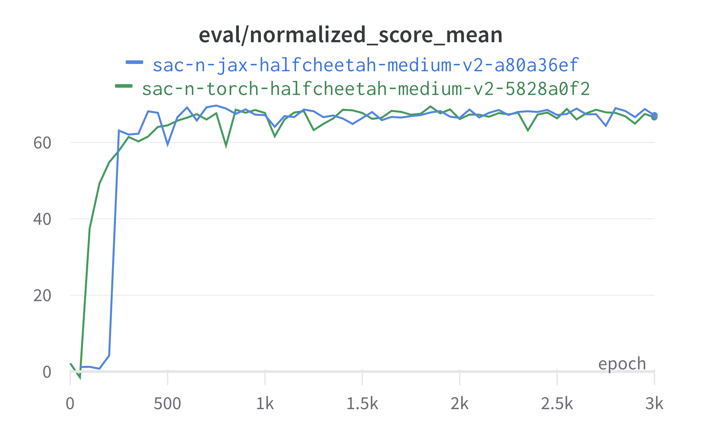
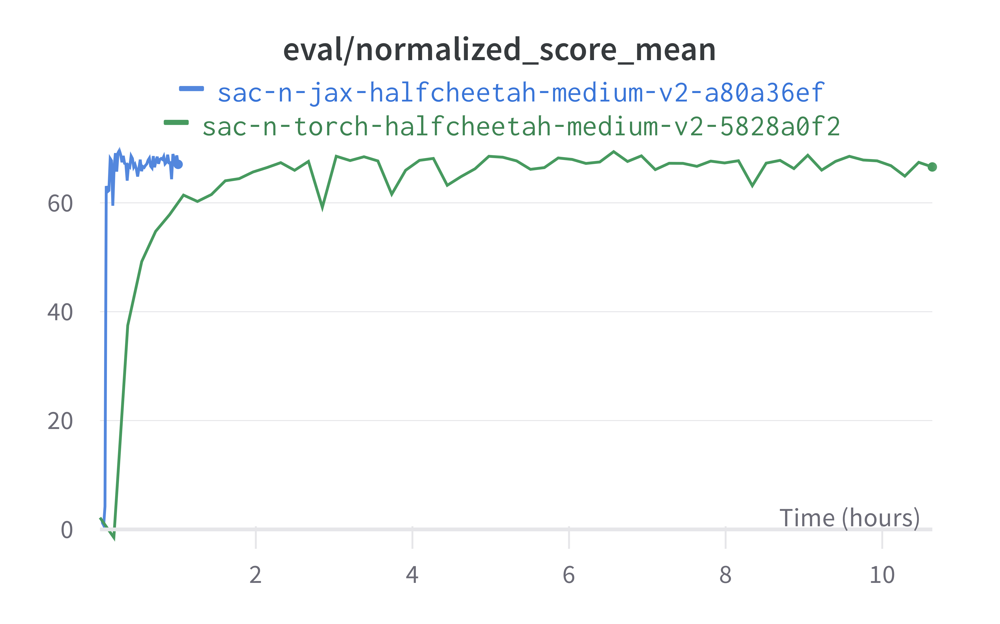

# SAC with Q-Ensemble for Offline RL

Single-file SAC-N [1] implementation on jax & flax. 10x faster than SAC-N on pytorch from CORL [2]. 

And still easy to use and understand! To run:

```bash
python sac_n_jax_flax.py --env_name="halfcheetah-medium-v2" --num_critics=10 --batch_size=256
```
Optionally, you can pass `--config_path` to the yaml file, for more see [pyrallis](https://github.com/eladrich/pyrallis) docs.

Main insight here is to jit epoch loop, not just one update of the networks, as it is usually done ([jaxrl2](https://github.com/ikostrikov/jaxrl2/blob/main/examples/train_offline.py) for instance). 

## Speed comparison
Both runs were trained on same V100 GPU.





# References

1. [Uncertainty-Based Offline Reinforcement Learning with Diversified Q-Ensemble](https://arxiv.org/abs/2110.01548) [[code](https://github.com/snu-mllab/EDAC)]
2. [Research-oriented Deep Offline Reinforcement Learning Library](https://arxiv.org/abs/2210.07105) [[code](https://github.com/tinkoff-ai/CORL)]
